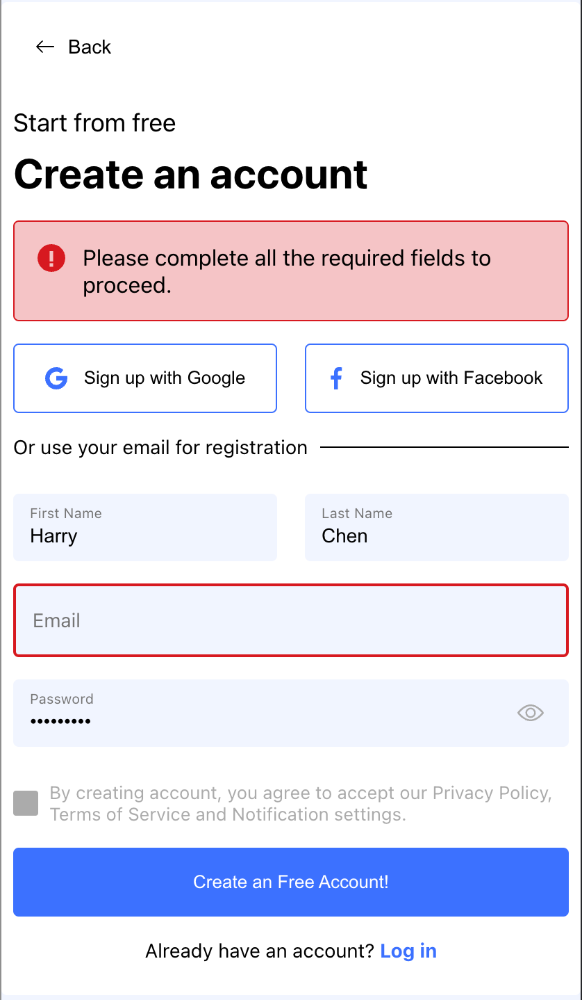

# FED Task

This is a Front-End/UI Developer Task. I used React.js to build the project. I used the following libraries:

- [React-hook-form](https://react-hook-form.com/) - for form validation
- [Zod](https://github.com/colinhacks/zod) - schema validation with static type inference

And I used [Vite](https://vitejs.dev/) as the build tool.

## Prerequisites

Make sure you have the following installed:

- [Node.js](https://nodejs.org/) (version 20 or higher)
- [npm](https://www.npmjs.com/)

## Getting Started

### Clone the Repository

```bash
git clone https://github.com/qqharry21/fed-task.git
cd fed-task
```

### Install Dependencies

```bash
npm install
```

### Run the Development Server

```bash
npm run dev
```

Open [http://localhost:8080](http://localhost:8080) in your browser.

### Build for Production

You can test it locally by running the following command:

```bash
npm run preview
```

This will build the project and serve it locally. Open [http://localhost:8081](http://localhost:8081) in your browser.

After testing, you can build the project for production by running:

```bash
npm run build
```

## CI/CD

I used **Github Action** for CI/CD. The workflow is defined in `.github/workflows/deploy.yml`. It will build the project and deploy it to Github Pages.

## Live Demo

You can view the live demo [here](https://qqharry21.github.io/fed-task/).

## Screenshots

### Desktop


Field input


Password reveal


Password match


Password tick


From validation


### Mobile


